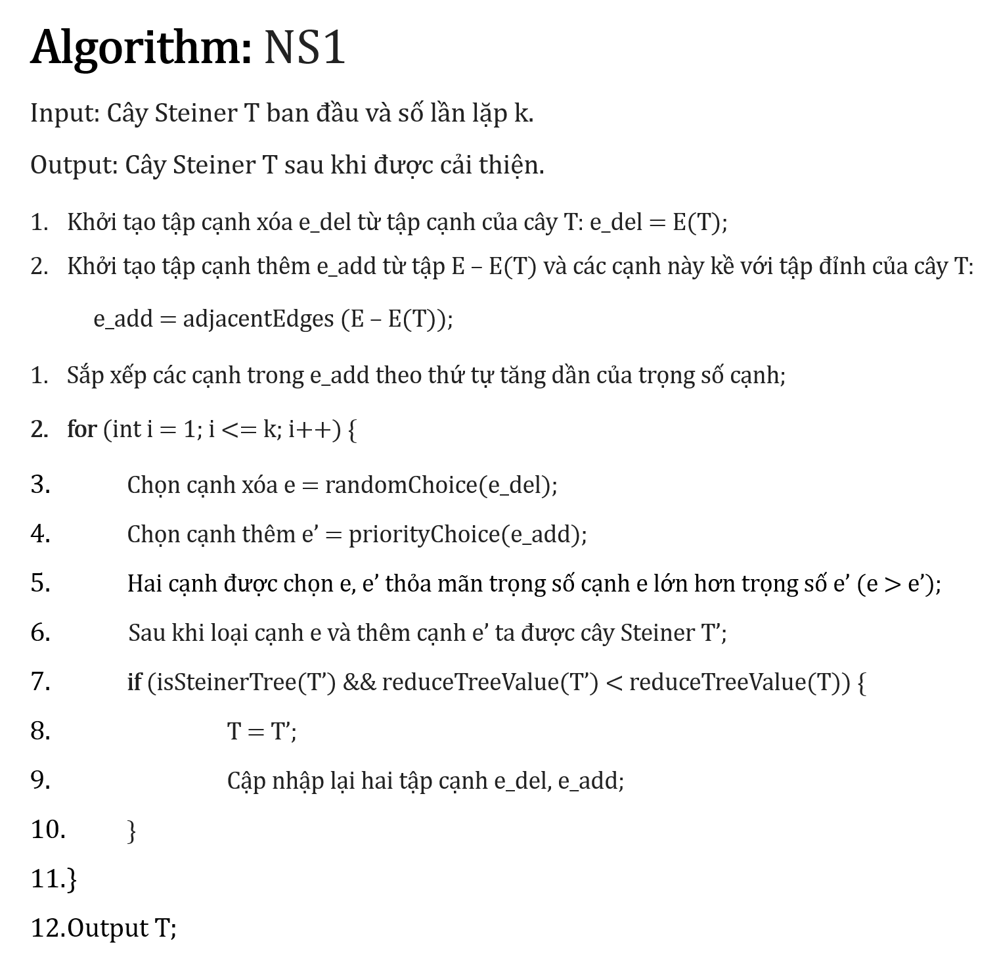
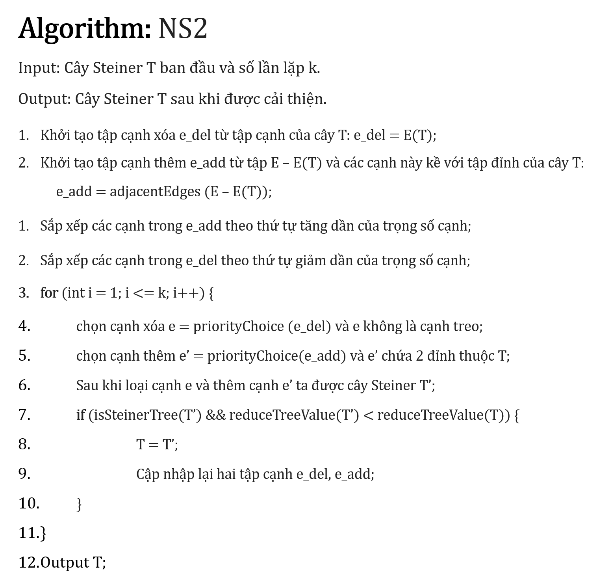
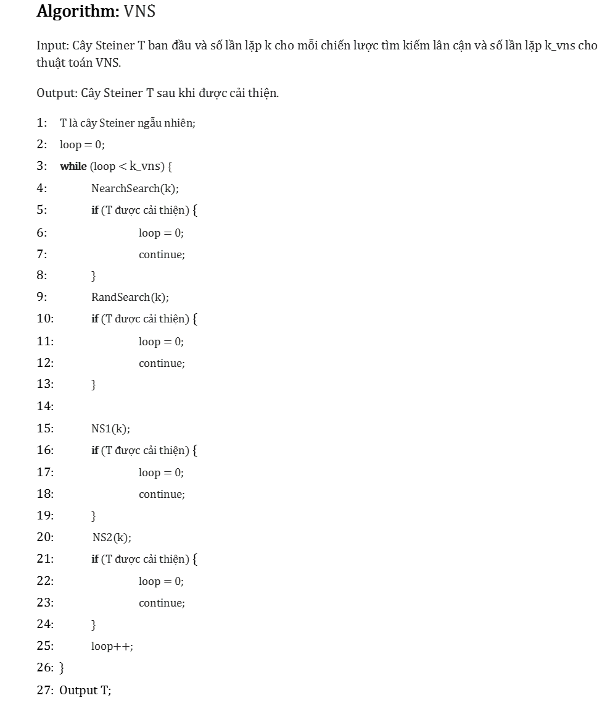

<div align="center">

# Steiner Minimal Tree
Using variable neighborhood search (VNS-NS).

</div>

---
- [Giới thiệu](#giới-thiệu)
- [Cấu trúc tập tin](#cấu-trúc-tập-tin)
- [Giải thuật](#giải-thuật)
- [Thực nghiệm](#thực-nghiệm)
---

## Giới thiệu
Thuật toán giải quyết bài toán Steiner Minimal Tree (SMT) sử dụng tìm kiếm lân cận biến đổi (VNS-NS). Đề xuất và cài đặt thêm 2 chiến lược tìm kiếm lân cận. Thực nghiệm trên 3 bộ dữ liệu với số đỉnh lên đến 1000. *Đây là thuật toán được cài đặt hỗ trợ cho bài báo khoa học của ThS. Trần Việt Chương và TS. Phan Tấn Quốc*.

> Mục đích của thuật toán này là cải thiện chất lượng của một cây Steiner đã tồn tại.

## Cấu trúc tập tin

```main.cpp```: Chương trình cài đặt thuật toán tìm kiếm lân cận biến đổi sử dụng 4 chiến lược tìm kiếm lân cận.

```PD_STEINER.cpp```: Chương trình cài đặt thuật toán tìm kiếm lân cận biến đổi cải tiến 2 chiến lược tìm kiếm lân cận (**Search_1**, **Search_2**).

Tối ưu chương trình, cải thiện khả năng chọn điểm rơi và tăng tính hội tự khi chọn cạnh để tìm kiếm lân cận.

```Tests```: Các bộ dữ liệu thực nghiệm.
  + ```steinb```: n = 50...100
  + ```steinc```: n = 500
  + ```steind```: n = 1000
  + ```steine```: n = 2500
  + ```steinf```: n = 10000
  + ```steing```: n = 20000
  + ```steinh```: n = 50000
  + ```steini```: n = 100000

## Giải thuật

### 1| Chiến lược tìm kiếm lân cận NeighSearch
Thủ tục tìm kiếm lân cận bắt đầu từ cây Steiner T được tiến hành như sau: Loại ngẫu nhiên khỏi T một cạnh e, chọn ngẫu nhiên cạnh e ’ từ tập E - E(T), nếu tập cạnh E(T) - {e} ∪ {e’} cho ta cây Steiner T' có chi phí tốt hơn T (chi phí của cây được tính với việc đã loại bỏ những cạnh dư thừa) thì ghi nhận cây Steiner này. Thủ tục trên sẽ được lặp lại k lần đối với cây Steiner T, trong số các cây Steiner được ghi nhận chọn ra Tbest là cây Steiner tốt nhất nếu cây T’ có chi phí tốt hơn thì đặt Tbest = T’. Như vậy ta thu được cây Tbest có chi phí tốt nhất sau k lần lặp. Hàm tìm kiếm lân cận vừa mô tã được đật tên là NeighSearch(T, k).

### 2| Chiến lược tìm kiếm lân cận RandSearch
Tìm kiếm ngẫu nhiên cho cây Steiner T được tiến hành tương tự như tìm kiểm lân cận NeighSearch không quan tâm đến chi phí trên cạnh: Loại ngẫu nhiên cạnh e trong T, tìm ngẫu nhiên một cạnh e’ từ tập E - E(T) sao cho E(T) – {e} ∪ {e’} cho ta cây Steiner T’ (không quan tâm đên việc T’ có tôt hơn T hay không). Sau khi lặp lại k lần thao tác trên, ta cập nhật T = T’ (T’ là cây có chi phí tốt nhất trong k lần lặp và chi phí của cây được tính với việc đã loại bỏ những cạnh dư thừa).

### 3| Chiến lược tìm kiếm lân cận NS1 (tự đề xuất)
Cho cây Steiner T. Loại ngẫu nhiên khỏi T một cạnh e, chọn ngẫu nhiên cạnh e’ từ tập E - E(T), nhưng cạnh e’ thêm vào cây T thì ta lấy ngẫu nhiên từ tập những cạnh kề với tập đỉnh của cây T trong tập E – E(T) trên tiêu chí là chi phí càng nhỏ thì tỉ lệ chọn càng cao và trọng số cạnh e phải lớn hơn trọng số cạnh e’. Sau khi loại cạnh e và thêm cạnh e’ ta được cây Steiner T’ có chi phí nhỏ hơn thì ghi nhận T = T’. Lặp lại k lần thủ tục này, ta được cây T có chi phí tốt nhất.

### 4| Chiến lược tìm kiếm lân cận NS2 (tự đề xuất)
Cho cây Steiner T. Loại ngẫu nhiên khỏi T một cạnh e, e là cạnh được chọn ngẫu nhiêu với việc ưu tiên chọn cạnh có chi phí lớn (chi phí cạnh càng lớn thì tỉ lệ chọn càng cao). Sau đó tìm ngẫu nhiên một cạnh e’ từ tập cạnh kề với tập đỉnh của cây T trong tập E – E(T), với e’ là cạnh ngẫu nhiêu với việc ưu tiên chọn cạnh có chi phí nhỏ (chi phí cạnh càng nhỏ thì tỉ lệ chọn càng cao) sao cho e không là cạnh treo và e’ chứa 2 đỉnh thuộc cây T. Nếu E(T) – {e}  {e’} cho ta cây Steiner T’ có chi phí tốt hơn T thì ghi nhận cây Steiner này T = T’. Lặp lại k lần thủ tục này, ta thu được cây T có chi phí tốt nhất.

### Mã giả của NS1 & NS2 (sau khi được cải tiến)



<br>



<br>


### Thuật toán tìm kiếm lân cận biến đổi
Vấn đề lớn nhất mà các thuật toán metaheuristic gặp phải là nó dễ rơi vào bẫy tối ưu cục bộ. Để giải quyết vấn đề này, chúng tôi đề xuất việc kết hợp thuật toán tìm kiếm lân cận biến đổi với một số chiến lược tìm kiếm lân cận để hy vọng nâng cao chất lượng lời giải của thuật toán.

Ý tưởng của thuật toán tìm kiếm lân cận biến đổi (Variable Neighborhood Search - VNS) là thực hiện lần lượt từng chiến lược tìm kiếm lân cận, hết chiến lược tìm kiếm lân cận này đến chiến lược tìm kiếm lân cận khác; trong quá trình thực hiện thuật toán VNS, ta luôn ghi nhận lời giải tốt nhất (kỷ lục).

Khi thực hiện một chiến lược tìm kiếm lân cận, nếu tìm được kỉ lục mới thì ta quay trở lại thực hiện thuật toán VNS từ đầu. Ngược lại, ta chuyển sang chiến lược tìm kiếm lân cận tiếp theo; quá trình được tiếp tục cho đến khi thực hiện hết tất cả các chiến lược tìm kiếm lân cận mà lời giải tốt nhất không được cải thiện.

*Mã Giả*



## Thực nghiệm

### 1| Môi trường thực nghiệm

+ **Ngôn ngữ lập trình** : C++
+ **Phiên bản trình biên dịch**: g++ 5.1.0
+ **Hệ điều hành**: Windows Server 2008 R2 Enterprise 64-bit (6.1, Build 7601)
+ **CPU**: Intel(R) Xeon(R) CPU E5-2660 @2.20GHz
+ **RAM**: 16GB

### 2| Bộ dữ liệu thực nghiệm
Thực nghiệm trên 3 bộ dữ liệu
+ [Steinb](./Tests/steinb)
+ [Steinc](./Tests/steinc)
+ [Steind](./Tests/steind)

| Dataset | n             | m                            | \|L\|                  |
|---------|---------------|------------------------------|------------------------|
| steinb  | [50, 75, 100] | [63, 94, 100, 125, 150, 200] | [9, 13, 25]            |
| steinc  | 500           | [625, 1000, 2500, 12500]     | [5, 10, 83, 125, 250]  |
| steind  | 1000          | [1250, 2000, 5000, 25000]    | [5, 10, 167, 250, 500] |

### 2| Kết quả kiểm thử
[Chi tiết kết quả kiểm thử](./Results)

**Kết quả thực nghiệm của bộ *steinb* (VNS)**
|     Test     | Default Cost | Tất Cả | Tất cả |    Tất cả    | Best Result | Khoảng cách với best result |
|:------------:|:------------:|:------:|:------:|:------------:|:-----------:|:---------------------------:|
|              |              |  Cost  |  Time  | Reduced Cost |             |                             |
|  steinb1.txt |      293     |   265  |  5023  |      82      |      82     |              0              |
|  steinb2.txt |      263     |   247  |  6040  |      83      |      83     |              0              |
|  steinb3.txt |      255     |   231  |  8203  |      138     |     138     |              0              |
|  steinb4.txt |      272     |   239  |  7231  |      59      |      59     |              0              |
|  steinb5.txt |      249     |   215  |  12302 |      61      |      61     |              0              |
|  steinb6.txt |      252     |   191  |  13023 |      122     |     122     |              0              |
|  steinb7.txt |      416     |   381  |  15203 |      111     |     111     |              0              |
|  steinb8.txt |      419     |   379  |  14345 |      104     |     104     |              0              |
|  steinb9.txt |      404     |   366  |  19236 |      220     |     220     |              0              |
| steinb10.txt |      410     |   376  |  16340 |      86      |      86     |              0              |
| steinb11.txt |      347     |   283  |  34203 |      88      |      88     |              0              |
| steinb12.txt |      401     |   330  |  34239 |      174     |     174     |              0              |
| steinb13.txt |      535     |   522  |  36321 |      165     |     165     |              0              |
| steinb14.txt |      530     |   524  |  41032 |      235     |     235     |              0              |
| steinb15.txt |      553     |   513  |  39483 |      318     |     318     |              0              |
| steinb16.txt |      564     |   497  |  47203 |      127     |     127     |              0              |
| steinb17.txt |      519     |   424  |  45773 |      134     |     131     |              3              |
| steinb18.txt |      509     |   409  |  58393 |      218     |     218     |              0              |

<br><br>

**Kết quả thực nghiệm của bộ *steinc* (VNS)**
|     Test     | Default Cost | Tất cả |  Tất cả  |    Tất cả    | Best Result | Khoảng cách với best result |
|:------------:|:------------:|:------:|:--------:|:------------:|:-----------:|:---------------------------:|
|              |              |  Cost  |   Time   | Reduced Cost |             |                             |
|  Steinc1.txt |     2424     |  2410  |  4543124 |      85      |      85     |              0              |
|  Steinc2.txt |     2626     |  2620  |  5487232 |      144     |     144     |              0              |
|  Steinc3.txt |     2680     |  2659  |  8293749 |      760     |     754     |              6              |
|  Steinc4.txt |     2751     |  2688  | 10283822 |     1081     |     1079    |              2              |
|  Steinc5.txt |     2798     |  2573  |  6992935 |     1580     |     1579    |              1              |
|  Steinc6.txt |     2236     |  2228  |  9203818 |      55      |      55     |              0              |
|  Steinc7.txt |     2319     |  2241  | 12954903 |      104     |     102     |              2              |
|  Steinc8.txt |     2714     |  2552  | 14284653 |      531     |     509     |              22             |
|  Steinc9.txt |     2720     |  2444  | 16373894 |      728     |     707     |              21             |
| Steinc10.txt |     2841     |  2071  | 27485632 |     1113     |     1093    |              20             |
| Steinc11.txt |     2634     |  2634  | 19283920 |      35      |      32     |              3              |
| Steinc12.txt |     2661     |  2626  | 23018248 |      60      |      46     |              14             |
| Steinc13.txt |     2846     |  2539  | 32934392 |      274     |     258     |              16             |
| Steinc14.txt |     2740     |  2249  | 29103823 |      368     |     323     |              45             |
| Steinc15.txt |     2796     |  1792  | 33918294 |      598     |     556     |              42             |
| steinb16.txt |      564     |   497  |   47203  |      127     |     127     |              0              |
| steinb17.txt |      519     |   424  |   45773  |      134     |     131     |              3              |
| steinb18.txt |      509     |   409  |   58393  |      218     |     218     |              0              |

<br><br>

**Kết quả thực nghiệm của bộ *steind* (VNS)**
|     Test     | Default Cost | Tất cả |  Tất cả |    Tất cả    | Best Result | Khoảng cách với best result |
|:------------:|:------------:|:------:|:-------:|:------------:|:-----------:|:---------------------------:|
|              |              |  Cost  |   Time  | Reduced Cost |             |                             |
|  steind1.txt |     5140     |  5137  | 2405756 |      106     |     107     |              -1             |
|  steind2.txt |     5107     |  5090  | 2290665 |      233     |     228     |              5              |
|  steind3.txt |     5511     |  5332  | 1810696 |     1584     |     1593    |              -9             |
|  steind4.txt |     5257     |  4965  | 2560766 |     1951     |     1957    |              -6             |
|  steind5.txt |     5500     |  5003  | 1840724 |     3260     |     3270    |             -10             |
|  steind6.txt |     5567     |  5470  | 2454514 |      72      |      70     |              2              |
|  steind7.txt |     5013     |  4742  | 4546194 |      103     |     103     |              0              |
|  steind8.txt |     5289     |  4791  | 2890566 |     1187     |     1104    |              83             |
|  steind9.txt |     5421     |  4620  | 5299250 |     1553     |     1500    |              53             |
| steind10.txt |     5356     |  4095  | 6818230 |     2197     |     2141    |              56             |
| steind11.txt |     4657     |  4652  | 4024126 |      31      |      29     |              2              |
| steind12.txt |     5637     |  4536  | 3738123 |      53      |      42     |              11             |
| steind13.txt |     5146     |  4541  | 8100225 |      616     |     518     |              98             |
| steind14.txt |     5368     |  4655  | 7028417 |      713     |     691     |              22             |
| steind15.txt |     5244     |  3520  | 8672390 |     1299     |     1134    |             165             |
| steinb16.txt |      564     |   497  |  47203  |      127     |     127     |              0              |
| steinb17.txt |      519     |   424  |  45773  |      134     |     131     |              3              |
| steinb18.txt |      509     |   409  |  58393  |      218     |     218     |              0              |


**Ghi Chú**


> Thời gian được tính bằng đơn vị ms.

> Kết quả này được thực hiện với số lần lặp k cho mỗi chiến lược tìm kiếm lân cận NS1, NS2 là (n * m) / 2 và điều kiện để thuật toán VNS kết thúc là phải sau k_vns = 10 * n số lần lặp mà kết quả của cây Steiner không được cải thiện (không tìm dược kỉ lục mới) thì mới dừng lại. Với số lần lặp lớn như vậy, thời gian để chạy thuật toán VNS sẽ khá lớn. Nhưng kết quả cây Steiner nhận được sẽ tốt hơn rất nhiều.
